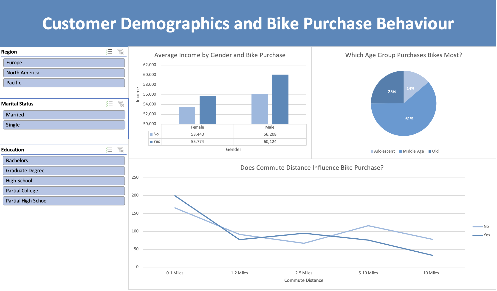

# Customer Demographics and Bike Purchase Behaviour

An interactive Excel dashboard exploring what drives bike purchasing decisions across 1,000+ customers in Europe, North America, and the Pacific. Built using Excel Pivot Tables, Pivot Charts, and slicers.



Figure 01: Interactive dashboard


Figure 02: Pivot tables and charts


Figure 03: Clean Data 


---

## Tools Used

- Microsoft Excel (Pivot Tables, Pivot Charts, Slicers, Dashboard)
- Data cleaning and age bracket categorisation using formulas

---

## Dataset

- **1,026 customer records** across 13 variables
- Variables include: gender, income, age, marital status, education, occupation, number of cars, commute distance, region, and bike purchase outcome
- Regions covered: North America (50%), Europe (31%), Pacific (20%)

---

## Key Insights

### 1. Income influences purchase decisions
Customers who bought a bike earned more on average than those who did not, across both genders:
- **Male buyers** averaged £59,603 vs £56,520 for non-buyers
- **Female buyers** averaged £55,267 vs £53,450 for non-buyers

### 2. Middle-aged customers dominate purchases
- **61%** of all bike purchases were made by middle-aged customers (31–54)
- Adolescents (under 31) accounted for 14% of purchases
- Older customers (55+) made up 25% of purchases

### 3. Commute distance is a strong predictor
- Customers commuting **0–1 miles** had the highest purchase rate — 207 buyers vs 171 non-buyers
- Purchase likelihood drops sharply at **10+ miles**, with only 33 buyers compared to 80 non-buyers
- Short-distance commuters are the most promising target segment

### 4. Single customers buy more bikes than married ones
- **Single customers**: 259 purchased (54% of singles)
- **Married customers**: 236 purchased (43% of married customers)

### 5. North America is the largest market
- North America accounts for nearly half of all customers (508 of 1,026)
- Europe and Pacific are smaller but still represented in the analysis

---

## Dashboard Features

- **3 interactive slicers**: filter by Region, Marital Status, and Education simultaneously
- **Bar chart**: average income by gender and bike purchase outcome
- **Pie chart**: age group distribution of bike buyers
- **Line chart**: commute distance vs purchase behaviour (Yes/No)

---

## How to Use

1. Download and open `data.xlsx`
2. Navigate to the **Dashboard** tab
3. Use the slicers on the left to filter by Region, Marital Status, or Education
4. Charts update automatically based on your selection

---

## Project Structure

```
├── Customer_Demographics_and_Bike_Purchase_Behaviour.xlsx
│   ├── Dashboard        # Interactive charts and slicers
│   ├── Pivot Table      # Underlying pivot tables and charts
│   └── Working Sheet    # Cleaned raw data with age bracket formula
└── README.md
```

---

## Skills Demonstrated

`Microsoft Excel` `Pivot Tables` `Data Visualisation` `Dashboard Design` `Data Cleaning` `Exploratory Data Analysis`
